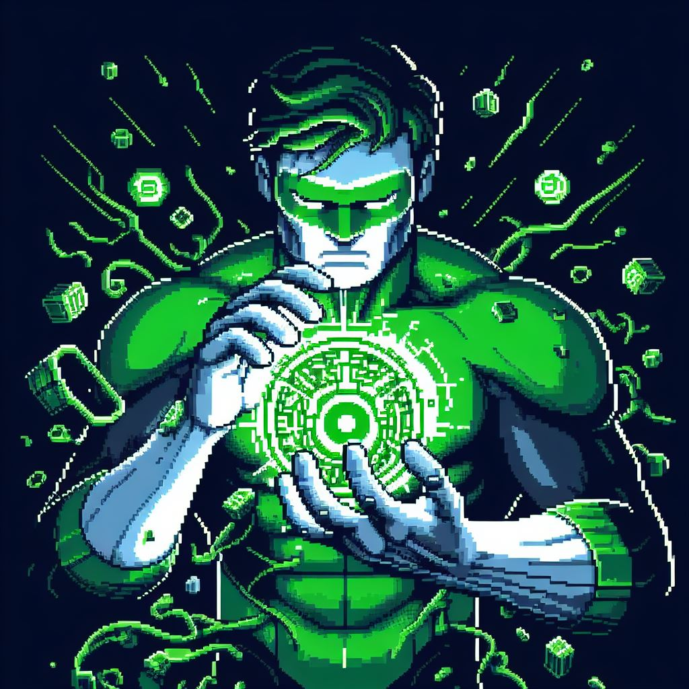

# Guardiões da Estrutura - Explorando as Linked Lists em Python 🐍

    

## 📖 Sobre o Projeto

Esse projeto foi uma realização do Bootcamp Santander 2024 em IA com a DIO 

O que você verá de conteúdo é uma mescla de aprendizado onde foi utilizado o ChatGPT para idéias e algumas explicações porém tive apoio e aulas de uma amiga chamada Ananda, reforço que todos os códigos foram revisados, testados e validados. Foi um projeto incrível que tive a oportunidade de realizar, ele é para fins didáticos e toda sugestão será bem vinda. 

Muito obrigado e aproveite 😄

## 🛠️ Tecnologias Utilizadas
- [ChatGPT](https://chatgpt.com/)
- [CoPilot](https://copilot.microsoft.com/)
- [PowerPoint](https://www.microsoft.com/pt-br/microsoft-365/powerpoint)

## 🚀 Prompts Utilizados
#### Chat GPT - Faça um texto para ebook , com foco em Algoritmos, explicando o que é e como funciona uma linked list 

{REGRAS} 

1. Você é um sênior em Algoritmos

2. Explique sempre de uma maneira simples

3. Se usar termos técnicos, simplifique eles

4. Utilize exemplos fáceis de entender

5. Sempre traga exemplos de código em contextos reais 

6. Sempre deixe um título sugestivo por tópico

Obs: houve vários outros códigos de refinamento, explicações e etc

#### Copilot - Green Lantern making a construct with ring, pixel art style, single color background

## 📚 Materiais e Recursos
- [Link para o Ebook](https://github.com/silaslva/ebook-Guardioes-da-Estrutura/blob/main/ebook%20%26%20template/ebook.pdf)
- [Link para o Template](https://github.com/silaslva/ebook-Guardioes-da-Estrutura/tree/main/ebook%20%26%20template)
- [Geeks for Geeks](www.geeksforgeeks.org) Site usado para as ilustrações e compreensão

## 📌 Localização

- Imagens utilizadas e artes adicionais em `images`
- ebook `ebook & templates`

## 🛠️ Instruções de execução

Use os prompts citados porém vá instruindo e guiando de acordo com a necessidade, peça explicação simples mais de uma vez. Se for preciso peça exemplos e assim por diante, dessa forma você obterá respostas variadas e assim combinar as respostas para gerar coisas ainda melhores

## 👨‍💻 DEV

    
    
&nbsp&nbsp&nbspSilas Silva 
    &nbsp&nbsp&nbsp
    <a href="https://github.com/silaslva">
    GitHub</a>&nbsp;|&nbsp;
    <a href="https://www.linkedin.com/in/silaslva">LinkedIn</a>
&nbsp;|&nbsp;
    <a href="https://www.instagram.com/silaslva/">
    Instagram</a>
&nbsp;|&nbsp;

  

